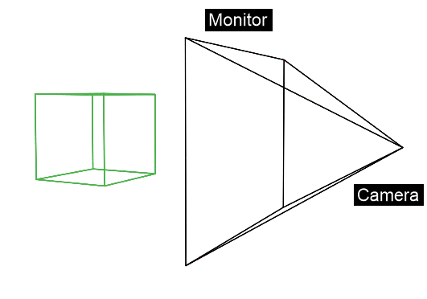
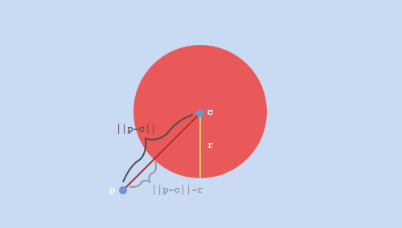
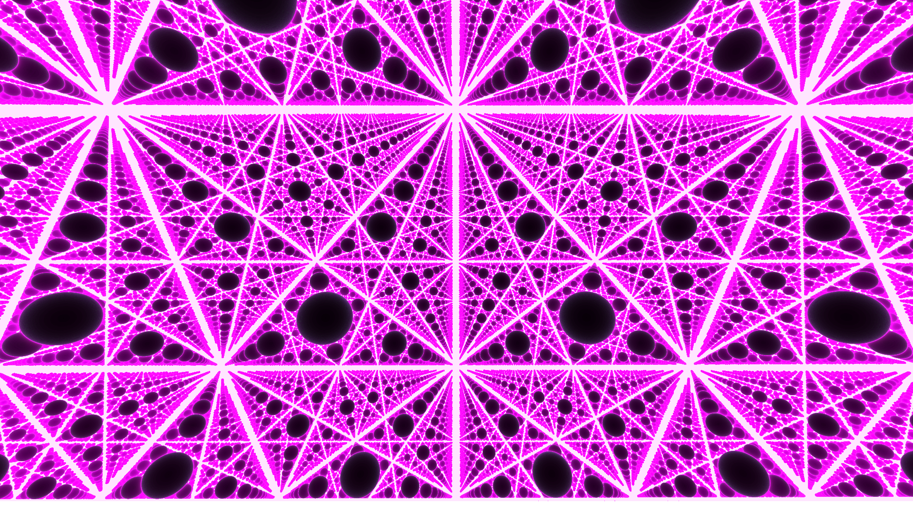

 
Cool is a software aimed at visual generative art, meaning it has to **render** - display a 2D or 3D scene onto a computer screen. To do so, Cool uses a specific technique called ***"Ray Marching"*** - fairly uncommon among computer graphic softwares, allowing for instance, a very quick rendering of scene with a lot of identical objects (a space filled with infinite spheres for example).<br></br>
### IMAGE INFINI ?
In this article we will present this technique and discuss about the pros and cons compared to other rendering methods used in the industry.
 
<!--truncate-->
 
### How do you represent a 3D image on a 2D screen ?
A commonly used way to render a 3D scene is called raytracing, but before explainig you how it works, we need to understand how an image is displayed on screen.
We have a 3D scene, in which we place a camera (i.e the point of view from where we are looking at the scene). From this point, we are watching a 3D scene that we have now to represent on a 2D plane : our computer screen. In order to do so, the process is exactly the same as for drawing. To draw a scene you are looking at with your eye (the camera), you will use the rule of perspective to project it on paper. For 3D images, we are simply replacing paper by the computer monitor. Eventually, we just have to use the perspective rules for each object of the scene and we will have the shape of our 3d scene. *Question : Perspective Implementée naturellement dans OpenGL non ?* Let's spice it up with colors !

 

Lofe
 
### Colors
Now that we know how to represent 3d shapes on a 2d screen, we can then make it more realistic, with lights, shadow and colors. In real world, the reason we see objects, is because of ***photons***. They are emitted by sources of light (sun, lamp)..., and will fly through space and time until hitting objects. Once they do so, they have three choices : either being absorbed, re-emitted or transmitted. It is that final bunch of protons emitted and transmitted by the object arriving up to our eyes that will make us "see" the object. For instance, an object reflecting every but "red" photons - light being the sum of all the nuances of colored photons on the visible spectrum - will only emit red photons towards us and therefore look red for the viewer.
 
### SHEMA VISION ?
 
Raytracing is a reversed version of what nature does. Instead of computing the reflection of photons emitted by sources and objects up to the camera (that would take far too long), we are going to cast a ray from our camera through every pixel of our screen, and calculate if this ray intersects with an object of our scene. If so, we check if there are any objects between our sources of light, and the point hit by the ray. We can now draw on our screen : if the ray casted from a specific pixel touches a part of an object, we know that we have to project that part of the object according to the distance between the pixel and the object on that particular pixel following the perspective. In addition, if this part of the object is in direct contact with any source of light, the pixel will be enlightened, otherwise it will be shadowy.


 
#### SHEMA RAYTRACING SCRATCHA PIXEL
 
One of the main concerns in the ray tracing method is finding the intersection between the ray you cast through your pixel (which is a straight line), and the shapes composing the objects of your scene. In practice, objects are often composed of thousands of small triangles or squares (= two triangles), and the goal is to find what triangle is touched by the ray sent through the pixel by the camera (\TROUVER UNE IMAGE MAYBE DE PERSOS DECOMPOSES EN TRIANGLE ?). We know analytically how to test and find an intersection between a straight line (the camera ray) and a triangle but two problems may appear :
1. The more complex your scene, the more triangles you get and therefore the more tests and calculs you have to do meaning a longer render time (for instance rendering a very repetitive pattern, thousands of distorted spheres will be very long all the more in real time).
2. There are some shapes you can't mathematically describe, and therefore you can't analytically find an intersection between itself and the ray defined as a straight line. For instance there are forms that you can't split in small triangles because of their complexity - such as fractals - or/and because it would imply too many triangles to have a good approximation of it and so, \making render time \explode.
 
The question is then : Is there a way to have a fast render for these specific objects (repetitive pattern of objects, fractals...) ? And yes ! Let me introduce to you... ray marching !
 
### Ray Marching
 
Let's summarize. To render an object, you will cast a ray - i.e a straight line - from the camera through every pixel of your screen and find how they intersect - or not - with this object to find out how to project this 3D shape onto your 2D computer monitor, following the rules of perspective. One way to find the intersection is to mathematically compute the straight line - shape intersection, and then figure out -by another intersection calculation - how they interact with lights for placing shadows accordingly ; it is *raytracing*. Another way to do - and this is what *cool* uses - is **RayMarching**
RayMarching is a more iterative approach to rendering. Instead of computing an intersection between a straight line and an object, we are going to process by "steps” along each ray shooted. How does it work ? I will show you right away !
 
At every step, we are going to determine the distance from our current position on the ray - the first step being the camera position - to every object of the scene. If none of these distances is close to zero (meaning that the ray is hitting one object) and if we didn't reach the max numbers of step, we move on to the next step : we "march" - hence the name of ray**Marching** - of the minimum distance we found between all the objects - in the ray direction. We then repeat the process until the ray meets an object or we arrive at the maximum number of steps. It is an iterative strategy where we march along the ray to determine the collision or not of the ray with the objects within the scene.
 
For instance, if my project contains three spheres. I send a ray through a pixel from the camera. I begin the first step at the camera position, and I compute my distances to these spheres : I found s1:2, s2:3, s3:6 meters. I can then surely advance on the ray direction of at least 2 meters (I am sure i won't be "inside" an object). I do so and then compute my distances : s1:4, s3:2, s3:1 meters. I advance 1 meter and check the distances again : s1:5, s2:0.01, s3:2.
**0.01** is close enough in my definition to say that the ray is hitting something - here sphere 2. So, I can send to my render algorithm, that on this pixel, 3 meters away following the camera direction (the distance I advanced along the ray in two steps : 2+1) is a part of sphere2, and render it accordingly.
 
### SHEMA RAY MARCHNG 3 SPHERES ? (Le faire moi même)
 
Thus, unlike raytracing, the issues are not mathematically finding an intersection point, but figuring out an expression of the distance position on the ray to object shape or outline, which is far easier for certain objects (LESQUELS ?).
For example, we can define a distance from any point in space (x, y, z) to a sphere s of center c, and radius r by the formula *(first and only math/code function you will see in this page, I promise)* :
```c
distance(p, s) = distance(p, c) - r; //Distance between the center of the sphere
                                //and the point minus the radius of the sphere
```

 
For a mathematical and coding development, see the bibliography ! :smile: (rajouter lien à biblio)
 
### Pros and cons of Raymarching
 
So, why did we choose to use rayMarching ? (A review avec Jules)
1. Innovative. Few softwares use it : allow creativity and a different approach to generative and procedural art (transition pt2)
2. RayMarching and cool workflow ==> Combine, blend, twist and apply a lot of different effects of "basic" shapes easy to do in raymarching, allowing to quickly create weird forms, that may be different or more difficult to achieve in other 3D softwares
3. Very quick render of a big number of the same objects (meshes vs distance comparison) : possibility to "infinitely" fill a space with a certain shape and navigate through it far fluidier than with meshes : very good for procedural worlds and art in general.


 
Autre chose ?
 
 
 
Source :

https://michaelwalczyk.com/blog-ray-marching.html
 


