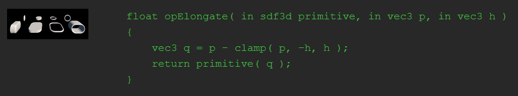

&nbsp&nbsp&nbsp&nbsp&nbsp 👩‍💻 GLSL is a pretty low-level language. But what if we turned it into a classy **functional programming language** capable of handling **higher-order functions**? That is, giving it the ability to pass functions as parameters to other functions. *Well, this is exactly what CoolLab does!*

<!--truncate-->

&nbsp&nbsp&nbsp&nbsp&nbsp In fact higher-order functions are so important that Inigo Quilez often usees them [in pseudo-code](https://iquilezles.org/articles/distfunctions/):

&nbsp&nbsp&nbsp&nbsp&nbspThis idea stemed from the observation that *modifiers*, in order to modify an existing SDF, must change either its input or its output (sometimes both). This is why a CoolLab graph cannot be interpreted as a flow of data between functions: some nodes even though after some other node, must apply changes to the input of the function coming before them. In order to make this generic and give each node full control, we hade to make this functional: each node receives one (or more) function.s, and does whatever it wants with them: it can evaluate them with different input, evaluate them several times, whatever!

TODO show how we define a node

TODO Show a graph

TODO Here is the code that gets generated: