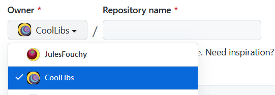

## Brief

If you are about to create a small system that doesn't have any dependencies on the rest of *Cool*, then making it into a standalone library makes a lot of sense.<br/>
We try to do that whenever possible because it encourages a more decoupled and flexible design, and makes it easily reusable by others without having to include the whole of *Cool*.

## How to

- Create a new repository from [our template](https://github.com/CoolLibs/library-template):
    - ⚠️ **Make sure the _Owner_ is set to CoolLibs, not to your personal account!**
    
    - Add a *short* description. (This is optional, you can add it later if you want).
    - Make sure the repo is public.
    - Don't check `Include all branches`.
    - Click `Create repository from template`.
- Clone the repo **recursively**: `git clone --recursive url/to/the/new/repo`.
- In the cloned repo, fill in "setup.py" and run the script: it will setup everything and then remove the Python scripts used for the setup.
- Amend the initial commit and rename it as `🎉 Initial commit`. You can then `force push` this initial commit.
- Add the library to [our list of **Standalone libraries**](https://github.com/CoolLibs/.github/edit/main/profile/README.md) under `## Standalone libraries` by adding:
```markdown
<a href="https://github.com/CoolLibs/mynewlib">
  
</a>
```
(NB: Replace the two occurences of `mynewlib` with the name of your library).
- Implement the library.
- Once the library is stable and you are ready to mark it as *v1*, make a release on GitHub and write an article about it in our blog.