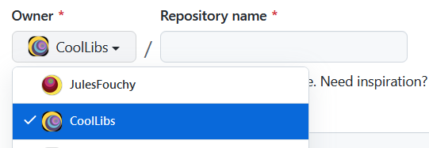

## Brief

If you are about to create a small system that doesn't have any dependencies on the rest of *Cool*, then making it into a standalone library makes sense. 
We try to do that whenever possible because it encourages a more decoupled and flexible design, and makes it easily reusable by others without having to include the whole of *Cool*.

## How to

- Create a new repository from [our template](https://github.com/CoolLibs/library-template). ⚠️ **Make sure the _Owner_ is set to CoolLibs, not to your personal account!**

- Make sure the repo is public.
- In the newly created repo, amend the initial commit to replace "mylib" with the name of the library all over the place, and rename the initial commit as `🎉 Initial commit`.
- Add it to [our list of libraries](https://github.com/CoolLibs/.github/edit/main/profile/README.md).