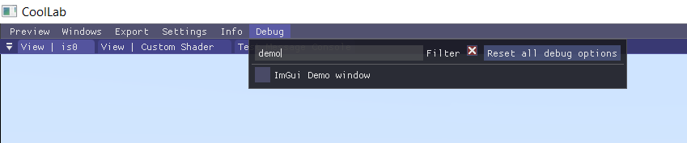

## The Demo Window

The Demo window is a very useful tool that will show you everything that is possible to do with *Dear ImGui*. It can be opened from the "Debug" menu:

## The Item Picker

If you want to see the code you need to call to create a given widget, use the **"Item Picker"** from the Demo window. Just click on any widget and it will take you to the corresponding piece of code in your IDE!

## Important *Dear ImGui* functions

### `Begin()` / `End()` to create a window

### `SameLine()`

### `Separator()`

### `PushID()` / `PopID()`

See [*Dear ImGui's FAQ about IDs*](https://github.com/ocornut/imgui/blob/master/docs/FAQ.md#q-about-the-id-stack-system).

## ImGui Extras

We have quite a few additional custom widgets available in [`<Cool/ImGui/ImGuiExtras.h>`](https://github.com/CoolLibs/Cool/blob/main/src/Cool/ImGui/ImGuiExtras.h).