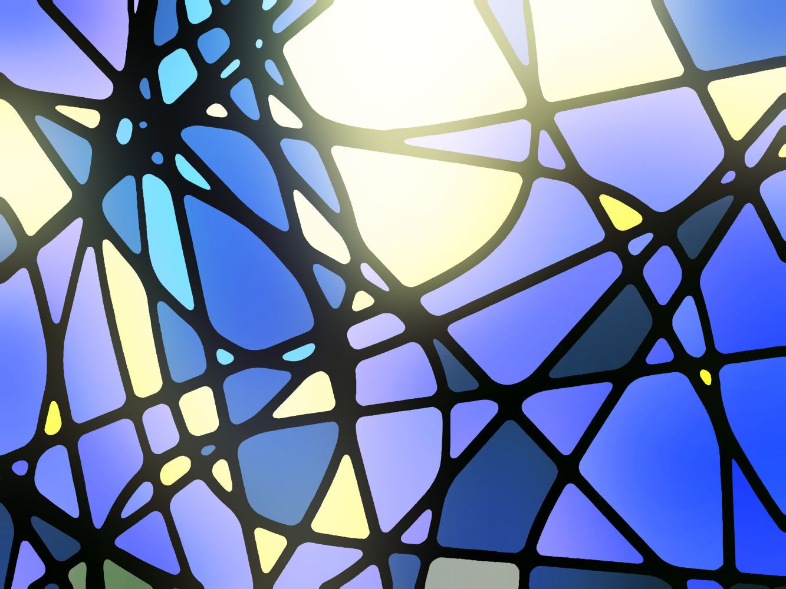

## Videos

- [Max Cooper - Order From Chaos (official video by Maxime Causeret)](https://youtu.be/_7wKjTf_RlI)
- [Max Cooper - Waves (official video by Kevin McGloughlin)](https://youtu.be/VGfayDKveAs)
- [Spaghetti Coder - Clockwise](https://vimeo.com/580893216)
- [N'to - Note Blanche](https://youtu.be/6fpQtKP92BI)

## Procedural techniques

- [Sebastian Lague - Coding Adventure: Ant and Slime Simulations](https://youtu.be/X-iSQQgOd1A)

## Use cases

- Split an image into several ones based on regions of similar brightness, then display those images on planes in 3D that are offset along the Z axis (cf Rom1)
- Stained glass: run a shader that creates distinct regions, then colorize those regions, then compute edges, then magnify those edges (blur + threshold), then add them back on top of the image. Then bloom on a given part of the image.
  
