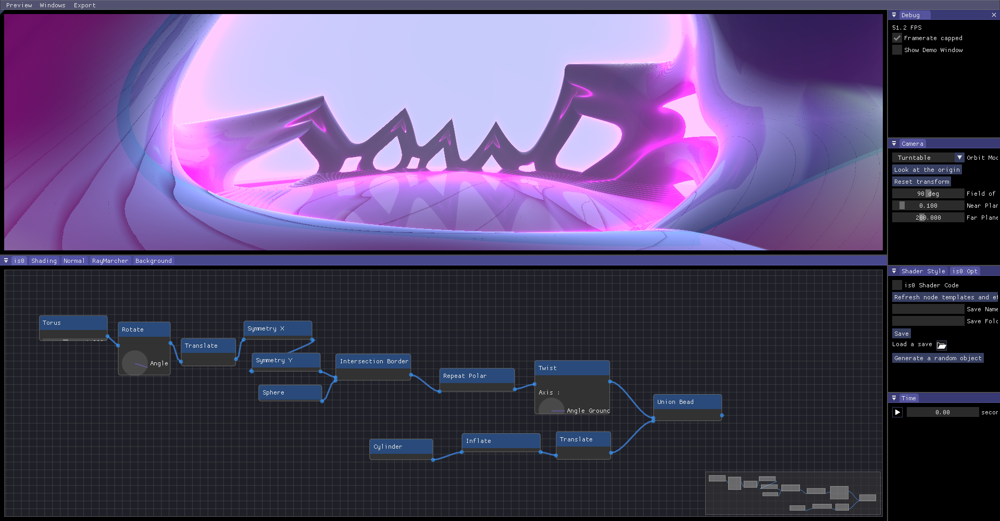

import LabGallery from "@site/src/components/LabGallery"

:::info Download
[**Download CoolLab for Windows**](/CoolLab-Windows.zip) 
[**Download CoolLab for Linux**](/CoolLab-Linux.zip) 
Download for MacOS will be available "soon", once their toolchain gets fully updated to the latest C++ version.
:::

Sponsor us :heart: Even 1$ goes a long way and makes us feel supported. TODO add link to github sponsor page

<LabGallery/>

<!-- 

[**Our Github**](https://github.com/CoolLibs/Lab) -->

## What is _CoolLab_?

[**CoolLab**](https://github.com/CoolLibs/Lab) is a patchwork of creative tools based on _Cool_. It is designed to do all kind of precedural image and video generation and will include some audio handling too one day.

## Who are we?

A group of programers who love making art. Since we are stubborn and ambitious we decided to build the software of our dreams, from scratch.

## What's in the name?

_CoolLab_ is a place to experiment, a _Lab_. This refers both to the experimental / exploratory nature of generative art, and the fact that by building this software we want to push the limits of software engineering and build the software of the future, using the lessons of the past decades in software development. Enter C++ 20, modules, functional programming, a decoupled architecture, and many more cool stuff!

_CooLab_ is also a pun on _collaboration_, reflecting our open-source nature and our desire to share knowledge and tools and build something grand together.

## The big plan

We want to build a software geared towards generative art. We also make our whole technology available and easily reusable in the form of a framework: [_Cool_](https://github.com/CoolLibs/Cool).

The goal of _CoolLab_ is to have both a software that uses _Cool_ so that we can work on the framework, and also to develop a genuinely cool software for artists and programmers.

My personal goal is to be able to produce abstract music videos with it. 

This project is still in the early phases of development, but you can already obtain cool results with it!

**_is0_, our node-based CSG modeler:**

