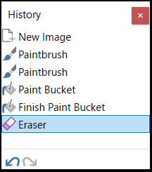

_**NB:**_ For a finer-grain breakdown of all the tasks there is to do, refer to our [GitHub Project](https://github.com/CoolLibs/Lab/projects/1) (and our [Trello](https://trello.com/b/PHSJwnta/cool-lab) that we should merge into the GitHub project at some point).

## ✅ Done

### Node system

- Integrate a library to create node graphs and use it to create scenes.
- Make it easy for any user to add new nodes.

### Ray Marching

- Generate a shader that contains the sdf of the scene (described by the node graph).
- Render that scene within the same shader.
- Implement many cool rendering effects that are allowed by Ray Marching.

### Parameter system

- Control them through the UI
- Save changes to them in a history
- Be able to create presets

## 🚧 Doing

### Abstract GPU API

- Create generic classes that can be implemented both with OpenGL and Vulkan to abstract those away and allow users to write cross-platform code.
- Add even more APIs, like WebGPU.
- Add a type-safe C++ wrapper around OpenGL: [GL++](https://github.com/CoolLibs/glpp).

### Setup a material system

- Have PBR materials and a UI for them.
- Attach those materials to objects in the is0 scene.

### Write libraries of shader functions

- Group common functions in libraries:
  - Camera and 3D geometry
  - Random
  - PBR calculations
  - Color conversions

### Meta language on top of glsl

- Add a `#include` directive.
- Add recursive functions.
- Do generic glsl parsing: look at [shaderc](https://github.com/google/shaderc) (https://www.youtube.com/watch?v=SXDlZRDjtXg) and [naga](https://github.com/gfx-rs/naga).

## 💪 To Do

### History

Add an ImGui-based debug tool that allows us the see the full state of the history, as in _paint.net_:



### Post-processing

- Here is a [great inspiration](https://youtu.be/Y3d8jR_IwYw?t=4378). Especially the gradient technique is pretty cool.
- Here is a very good resource about [bloom](https://youtu.be/tI70-HIc5ro).
- Here is a discussion of [outlines effects](https://alexanderameye.github.io/notes/rendering-outlines/) (the edge-detection one is particularly good).
- Edge detection
- Delaunay triangulation (on do we give it input data? Because we mostly work with images)
- non-affine transformations (like [circle inversion](https://youtu.be/hSsRcpIsunk?t=167) (might require that the input image is much higher res than the output one, because we might scale some parts of the input a lot. Ideally we could query on the fly the color at a given position instead of storing in images of given size => maybe we don't pass images around, but functions that ouput color (and they can have caching in the form of images) OMG: blur (and every effect based on the niehgboorhood of pixels) is wrong on the edges of an image because we lack the information of what is outside the image. Using functions that can give you color in any point in space would fix that. What about performance? We might really need the caching in form of an image. We could use `CachingStrategie`s: each layer can ask the input one for an image of a given size: for example blur could ask the input to generate an image slightly larger so that blur will have all the information it needs on the edges) Its not that big of a deal to store unused pixels (in case when a layer needs info from the input in a region that is not rectanglular, like circle inversion) as long as the images are not too big. We will need two different modes: when previewing we want to optimize for speed, but when exporting we want to minimize the memory we use, so in that case non-rectangular regions could be sampled on the fly instead of beeing cached in a texture. Problem with circle inversion: if the inveting circle is inside the image, it's center maps to infinity, which represents quite a lot of pixels: this is not a problem at all if we sample, but we absolutely cannot store this in a cache image).
- circle inversion is very cool because it preserves circle, so you can create an amazing image from a boring one that contains circles
- post-processing is actually equivalent to the compositing system

### Layer system

- Think about the design: How do we combine the outputs from our different systems or from different instances of the same system.
  Do we use a classic layer structure, or a graph?

One module = something that takes inputs and gives us outputs (often images (color, depth, mask (\approx_equal alpha) etc.), or even cubemaps (environment map for a 3D module)). E.g. : is0, the color grader, the depth of field effect etc.
Inputs can also be a camera for example. So that we can decide if the different modules share the same 3D camera or not.

The modules are composited in a graph system: you connect images outputed by one as input to another.

Users should be able to create entire modules as plugins that they can add to CoolLab easily.

How do we handle modules that are not a direct function of time? For example a physics or particle simulation: to know the state at time _t_ we need to run all the simulation from time _0_. This makes navigating in the timeline complicated. (NB: this is not that big of a problem is the simulation is just a few seconds long and then it cuts to another module on the timeline)

Some modules can just output raw data, and it will be the responsibility of another module to display it nicely.
=> Composition is at the heart of every good system, especially if we want it to be scalable and offer many possibilities and let the users control it and have freedom in it.
For example one module could output a density map (a 0 to 1 image), or a 2D distance field, and another would colorize it: apply a threshold and use only two colors, or anything else we might want.

Should we split is0 in two: the generation of the 3D distance field, and the rendering of it? (One problem would be that they would need to communicate through 3D textures (or do they? Can't we output a "function" (aka a shader, or a bit of glsl code) from a module? (one problem when exporting functions is that we don't have the ointermediate easily at hand to display it (but we can generate it though))))

Example workflow: stained glass:

- step 1: a shader that generates cells
- step 2: edge detection (outputs only the edges, we have to add them back manually later => atomic, composable workflow)
- step 3: make the edges bigger (blur + threshold)
- step 4: add the edges back onto the cells
- step 5: bloom

Watch videos from [this channel](https://youtu.be/o8QHGEtTynQ) and see if we can implement them in CoolLab; if we can't, why? Can we add a module that would allow us to do it?

The _timeline_ controls the sequencing of _scenes_. Scenes are independent of one another (even though they can share a few variables like color palettes); they don't know about each other's existence and the compositing between them is minimal: just your typical blending options. The fact that we can have multiple scenes is just here to account for the fact that we might want unrelated sequences one after the other in our video. This could be fully done within one scene by masking some modules depending on the time, but the UI is gonna much friendlier to use with a timeline. If you want complex logic between your "things", then want you want is to composite _modules_ inside a _scene_. (TODO allow to, in one click, turn seperate scene into just one, by adding a blend controlled by time in the new merged scene).

A scene is a graph that allows to compose _modules_ together; here there can be a lot of complexity and inter-dependence between modules. They can also be influenced by time. There is both local time (starts at 0 when the scene begins on the timeline) and global time (starts at 0 at the beginning of the timeline); both can be absolute (expressed in seconds), or relative (expressed as a fraction between 0 and 1 the corresponds to the advancement in the scene / timeline).
A module can be instanciated as many times as you want inside a scene (NB: we might want to have some parameters shared accross some instances of a module, and some other overriden by each instance; how do we do that?)

Maybe a scene could have access to the output of the scene that is below it on the timeline: this would allow to apply post-process to all scenes at once very easily. This is possible because all scenes have the same output: an RGBA image. (NB this means that scenes can control the size of the scene below it, for example to apply blur we need a slightly bigger input image).

Time is nothing too special; outside of the _timeline_ it shouldn't be a special variable: for example if we want to give a movement to our camera over time, this would be in two steps: create a curve / animation that describes the position of the camera as a fonction of a given value, and then input time as that value. This allows to change it for debugging purposes (replace time by a slider temporarily), or decide if we want to control the camera based on something else (e.g. the position of another object in the scene, or a noise value (which itself could be based on time)). This also allows, from a code perspective, to not depend on the details of the implementation of time, because in the future when we have a timeline there will be different notions of time (local vs gloabl and relative vs absolute).

You can create custom modules by grouping modules together. This solves the problem of sharing some values but not all: you decide what the inputs to your group are: those will be the ones that can be overriden. This also allows to have two scenes that are almost exactly the same except for one or two values: the scene system remains simple, but you still don't need to duplicate anything between similar scenes: you can create a modules group! In CoolLab you need functions (aka modules group) as in any other decent programming language!

### Color palettes

Use [IQ's color palettes](https://iquilezles.org/www/articles/palettes/palettes.htm) everywhere!

Can we generate an IQ palette from a discrete palette with colors hand-picked by an artist?

### Reaction diffusion

https://youtu.be/1S39WgB9F60

https://youtu.be/1S39WgB9F60

https://youtu.be/zp3P78YuZRg

### Particle system

2D and 3D.

Fully GPU based.

### Audio

- Import audio files and play them along the image generation (ideal to produce audio clips).
- Retrieve data from the audio to drive the images (pitch, bpm, volume etc.).
- We can search a lib in [this list](https://awesomeopensource.com/projects/audio-library). I currently found [miniaudio](https://github.com/mackron/miniaudio) for audio playback and [kfrlib](https://www.kfrlib.com/newdocs/index.html) or [aubio](https://aubio.org/) for audio analysis.

### Compile for the web

- Use emscripten and WebGL (or WebGPU) to be able to run our software in the browser.

### History / Multiple histories in parallel ?

### Lights system

### Simple compute shaders

Goal: simplify all the boilerplate required to setup a compute shader. Offer a simple interface / a few templates for the different situations.

### Project save

### Color spaces ?

### Bezier instead of interpolation for function curves (a.k.a. RGB curves).

See [Bezier Rgb Curves](https://github.com/CoolLibs/Cool/blob/main/src/Cool/RgbCurve/_README.md)

And how do we send these curves to the shader ? Do we bake it into a texture ?

### Premultiplied alpha

https://youtu.be/WtYfF48Z9mA?list=PL9_jI1bdZmz2emSh0UQ5iOdT2xRHFHL7E

https://youtu.be/klqSJiPqmGU

### Improve timeline navigation / display

https://youtu.be/Y3d8jR_IwYw?t=5577

### Keybinds remapping (inspired from Django ?)

### Scripting

Everything that is doable from the UI should be doable via scripting.

For the language I really like Typescript, but all options should be considered.

_**EDIT: Here is a genius idea:**_

We spawn a server which accepts HTTP requests. It then converts those requests into commands, which are submitted like any other command. This means that we can write our scripts in **_all the languages_**, we just have to know how to make HTTP requests. We could then provide helper libraries in Typescript, Python, etc. but fundamentally it will be easy for anyone to make the requests from the language of their choice!

It also saves us the trouble of integrating an interpreter for say Javascript into CoolLab: we let the "burden" on the user to have an interpreter (or compiler!) for the language of their choice and send requests from it. It is much easier to install Node.js than to integrate a JS interpreter in a software :hot_face:.

Pros:

- sfds

Cons:

- No unified stack. it's harder for people to share their scripts because someone might write in Lua, and then only people with a Lua interpreter can run it. It might also break depending on versions (Python2 vs Python3). If CoolLab were te decided on a lanugage, then you could be sure and that everybody writing scripts for CoolLab could share them easily. On the other hand it helps people to integrate CoolLab in their toolchain, no matter in what language they use, because CoolLab supports all languages.

### Scratch-like coding environment

[_Scratch_](https://youtu.be/6ziusIDac2g) is amazing: very easy to use, very intuitive, and very powerful!

Simpler to get started with than text-based scripting. Ultimately the text-based scripting and the block-based one should expose the same functionality so switching from one to the other should be pretty straight-forward. Moreover the block-based one can easily be converted into text automatically; this can be useful: you start with the simplest one (block-based), and can easily switch to text-based if you need to do more advanced stuff (even tough I believe that block-based can achieve everything as (or more) easily than text-based).

## The big plan: reactive systems, caching and modules compositing

### The command pattern

All changes to the state of the app happen through commands: a `Command` can be a nempty struct, or it can contain some data. The main app receives all the commands and executes / re-dispatches them accordingly. For example we could have a command:

```cpp
struct Command_SetCamera
{
    CameraId id;
    Camera value;
};
```

this would ask the application to change the camera with the given `id`. Then the application could tell all the modules that were using that camera that it changed and they need to recompute their outputs.

The great things about commands are:

- anyone can send them easily, and its easy to find in the code who can send what
- they cantralize all the changes; it allows us to implement an history without any of the modules having to be aware of it. (As well as recording all actions to replay them, or any other system that we could imagine. Modules ask for changes and they don't have to deal with all the complexity that come with it)
- they are easy to serialize: it is just a POD, a struct with some data, and no pointers (as long as we use IDs to identify our objects)

### Object IDs and Databases

Objects are identified by UUIDs (Universally Unique Identifiers). This allows us:

- to serialize references to objects (which raw C++ pointers and references can't do)
- Store the app state (aka project file) on GitHub and merge easily (this wouldn't be possible if the IDs were ordered (the first object gets ID 0 and the next 1 and so on. This is a probleme when 2 people work on the project at the same time and both create anobject with ID 0))

Object = ID + value

Everybody reference it through the ID, and the `Database` is the single source of truth for the value of the object. Everybody else stores the ID, not the value.

#### Shared objects

Cameras, parameters, etc.

-> Stop the parameters system that is too complicated, and let the history and everything be handled by the commands / database system.

#### List of dependencies

List of all modules that depend on each object, so that when an object changes we can update all the dependent modules (and the modules that depend on those modules)

### Rendering thread

### Auto Updating Render targets
